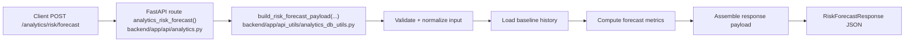
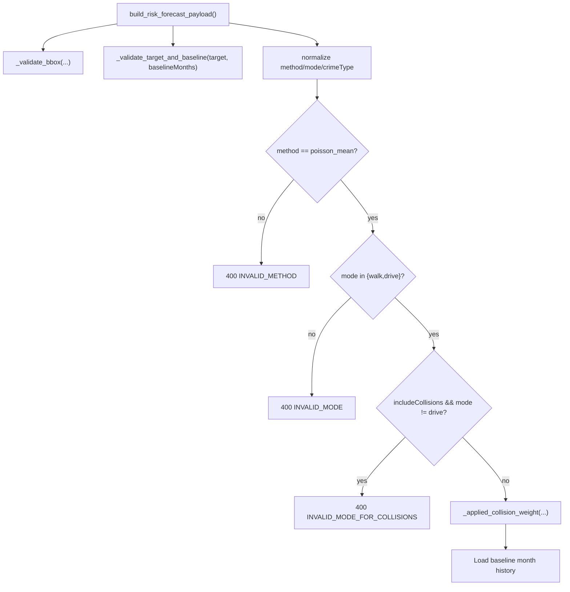
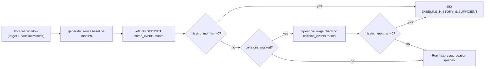
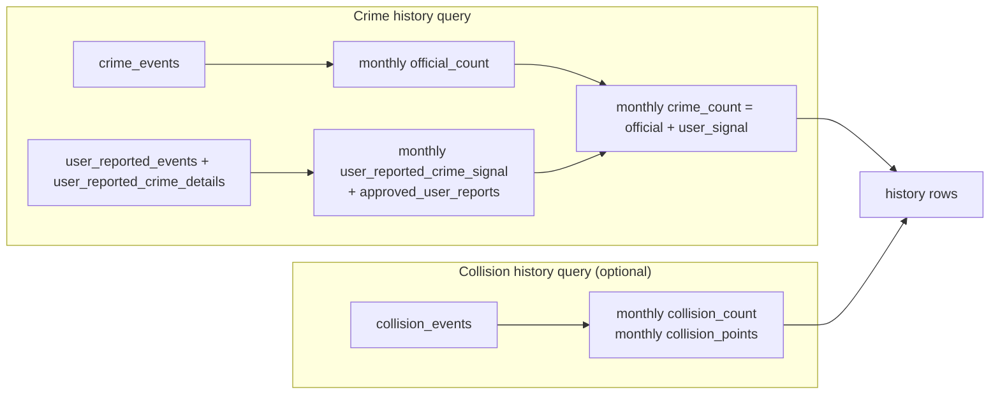
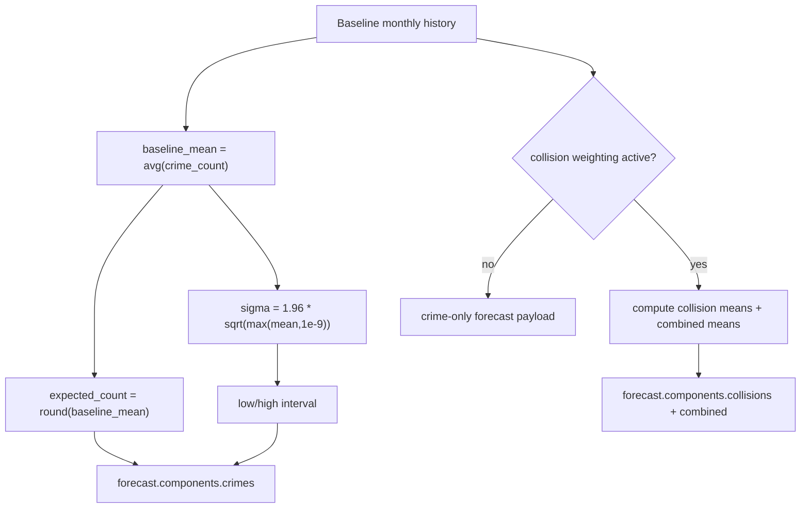

# Analytics Risk Forecast API - Detailed Flow Diagrams

This document explains how `POST /analytics/risk/forecast` works in the current codebase.

## 1) Endpoint Entry Point

The FastAPI route is thin:
- Accepts a `ForecastRequest` body.
- Passes all fields into `build_risk_forecast_payload(...)`.
- Returns `RiskForecastResponse`.



## 2) Request Contract and Validation Rules

`ForecastRequest` fields:
- `target` month (`YYYY-MM`)
- bbox: `minLon`, `minLat`, `maxLon`, `maxLat`
- optional `crimeType`
- `baselineMonths` (3..24)
- `method` (currently only `poisson_mean`)
- `returnRiskProjection` (optional extra projection block)
- `includeCollisions` (drive mode only)
- `mode` (`walk` or `drive`)
- `weights.w_crime`, `weights.w_collision`

Validation pipeline:
- bbox must be valid
- target + baseline window derived from `baselineMonths`
- method must be `poisson_mean`
- mode must be `walk` or `drive`
- collisions require `mode=drive`
- applied collision weight is 0 unless collisions are enabled in drive mode



## 3) Baseline Window and Coverage Checks

Before forecasting, the API confirms the baseline months exist in dataset coverage.

Checks in `_forecast_history_rows(...)`:
- Every month between `baseline_from_date` and `baseline_to_date` must exist in `crime_events`.
- If collisions are enabled, every baseline month must also exist in `collision_events`.
- Missing months cause `400 BASELINE_HISTORY_INSUFFICIENT`.



## 4) Data Sources and History Construction

History combines official crimes, approved user reports, and optional collision components per baseline month.

Primary sources:
- `crime_events` (official events in bbox/time)
- `user_reported_events` + `user_reported_crime_details` (approved user reports only)
- `collision_events` (when enabled)



## 5) User-Reported Signal Formula

User-reported crime signal is low-weight and capped:

```text
user_signal = 0.10 * min(
  3.0,
  distinct_authenticated_users
  + 0.5 * anonymous_reports
  + 0.25 * max(authenticated_reports - distinct_authenticated_users, 0)
)
```

Meaning:
- authenticated distinct users are strongest signal
- anonymous adds less weight
- repeated reports from same authenticated user add only partial weight
- signal is capped before final scaling

## 6) Forecast Math (Current `poisson_mean` Method)

From baseline history rows:
- `crime_counts = [monthly crime_count]`
- `baseline_mean = average(crime_counts)`
- `expected_count = round(baseline_mean)`
- uncertainty interval uses normal approximation around Poisson mean:

```text
sigma = 1.96 * sqrt(max(baseline_mean, 1e-9))
low  = floor(max(0, baseline_mean - sigma))
high = ceil(baseline_mean + sigma)
```

If collisions are active:
- compute means for `collision_count`, `collision_points`, and weighted `combined_value`
- include these under `forecast.components.collisions` and `forecast.components.combined`



## 7) Response Shape

Top-level response fields:
- `scope` (target, baselineMonths, bbox, crimeType, method, mode, includeCollisions)
- `generated_at`
- `score_basis` (`crime` or `crime+collision`)
- `history[]` (monthly baseline rows)
- `forecast` (expected counts, interval, components)
- `explanation` (human-readable notes)

Optional projection block when `returnRiskProjection=true`:
- `predicted_monthly_count`
- `predicted_band`
- `projection_basis` (`crimes` or `combined`)

Band projection logic:
- uses `combined_ratio` when collisions are active, else `ratio`
- `red` if ratio >= 1.5
- `amber` if ratio >= 1.25 and < 1.5
- `green` otherwise

```mermaid
sequenceDiagram
    participant Client
    participant API as analytics.py /risk/forecast
    participant Builder as build_risk_forecast_payload
    participant DB as Postgres/PostGIS

    Client->>API: POST forecast request
    API->>Builder: Forward request fields
    Builder->>Builder: Validate bbox/method/mode/window
    Builder->>DB: Coverage checks (crime months; optional collision months)
    DB-->>Builder: Coverage results
    Builder->>DB: Monthly baseline history queries
    DB-->>Builder: history rows
    Builder->>Builder: Compute baseline mean, expected_count, interval
    Builder->>Builder: Optionally add projection band
    Builder-->>API: RiskForecastResponse payload
    API-->>Client: 200 JSON
```

## 8) Error Surface

Likely typed errors:
- `400 INVALID_DATE_RANGE` (invalid baseline months)
- `400 INVALID_MONTH_FORMAT` (invalid target month format)
- `400 INVALID_BBOX`
- `400 INVALID_METHOD`
- `400 INVALID_MODE`
- `400 INVALID_MODE_FOR_COLLISIONS`
- `400 BASELINE_HISTORY_INSUFFICIENT`
- `503 DB_UNAVAILABLE` (query execution failure wrapped by `_execute`)

## 9) Practical Interpretation

- This is a baseline-mean forecast over the immediate historical window, not a complex time-series model.
- Approved user reports are blended into monthly crime counts via capped low-weight signal.
- Collision influence is opt-in and only supported in drive mode.
- `returnRiskProjection` adds a lightweight qualitative band from forecast ratios.
