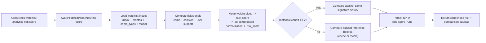

# Analytics Risk Score APIs - Current vs Legacy

This file is the quick index for risk-score docs.

- **Current implementation (recommended):**
  - `POST /watchlists/{watchlist_id}/analytics/risk-score`
  - `GET /watchlists/{watchlist_id}/analytics/risk-score/runs`
  - Full details: [watchlist-analytics-risk-score.md](./watchlist-analytics-risk-score.md)

- **Legacy implementation (still in codebase):**
  - `POST /analytics/risk/score`
  - Thin API wrapper around `build_risk_score_payload(...)`

## 1) Current Flow (Watchlist Analytics)

## 2) Why this is the primary path now

- Uses watchlist-owned preferences as single source of truth.
- Persists each run for traceability and history.
- Returns explicit comparison metadata proving what was compared.
- Uses versioned signature keys (`v2_log_norm`) so historical comparison cohorts are normalization-compatible.
- Supports simple historical retrieval endpoint for prior runs.

## 3) Legacy `/analytics/risk/score` note

The legacy endpoint remains available and computes a risk response for ad-hoc payload inputs, but it does not implement the same watchlist-owned persistence/comparison workflow as the new watchlist analytics stack.
