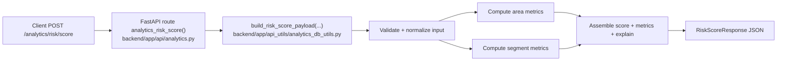
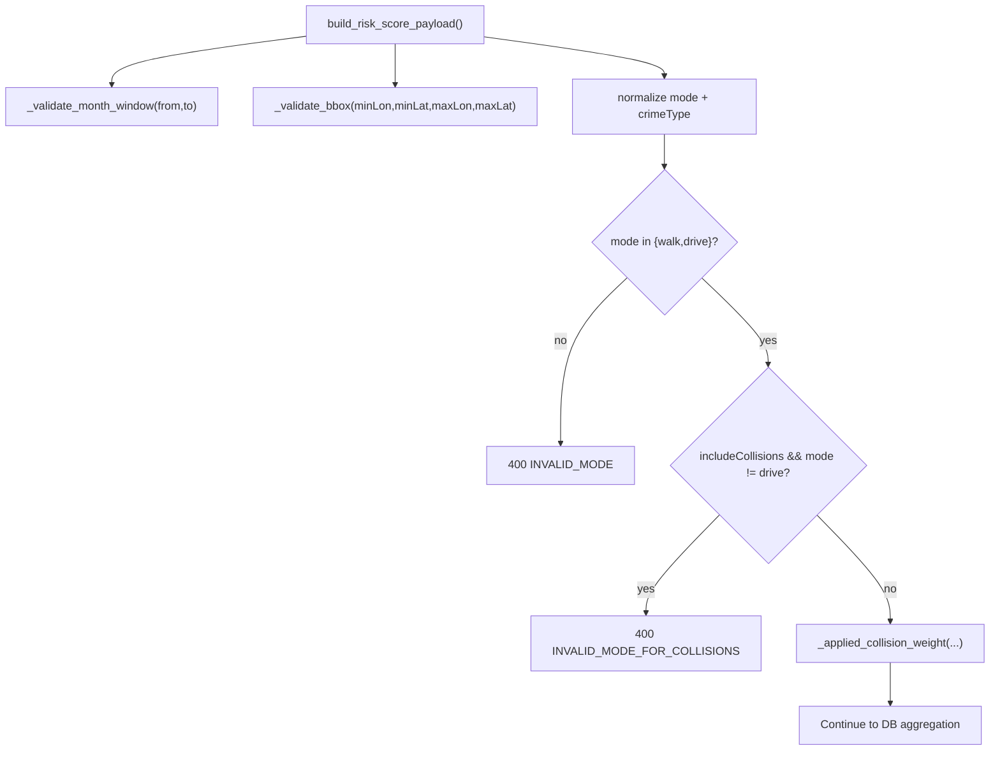
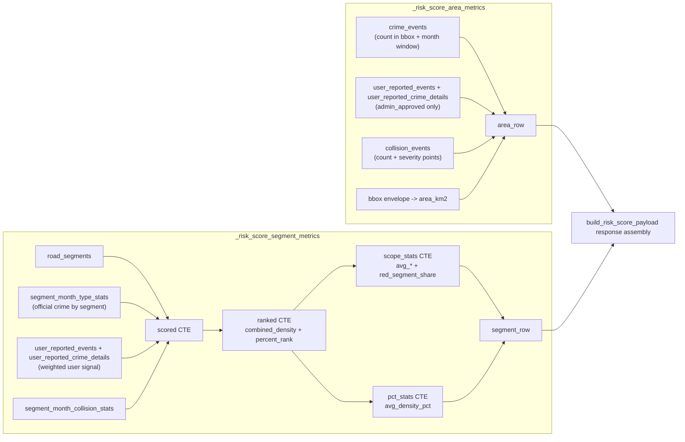
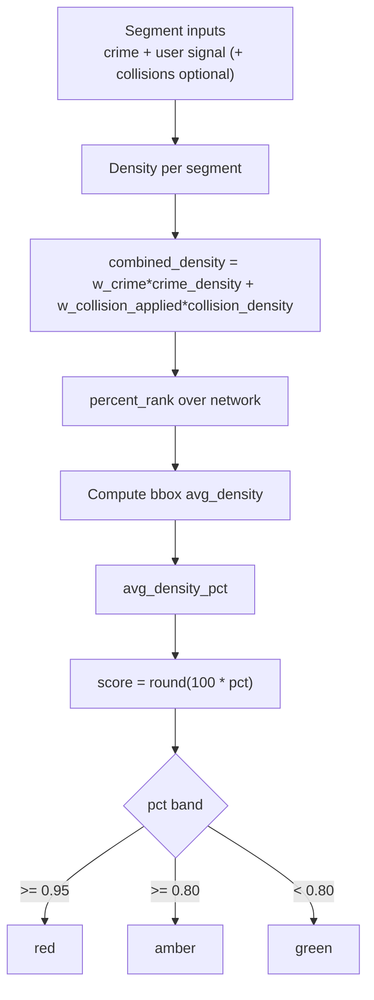
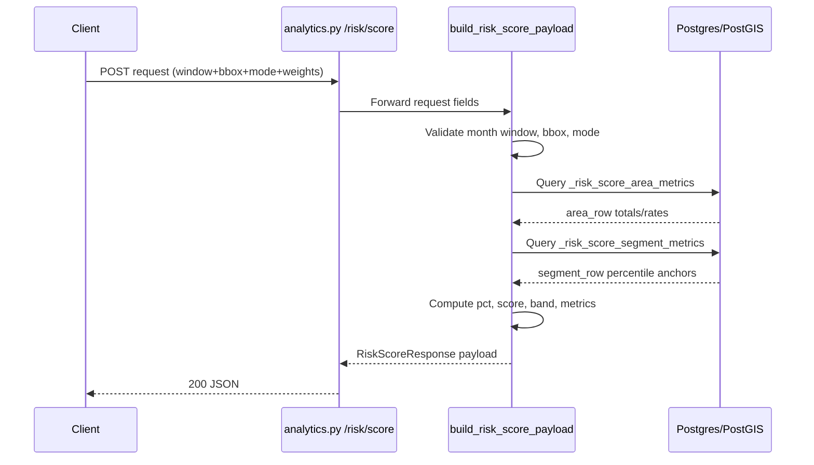

# Analytics Risk Score API - Detailed Flow Diagrams

This document explains how `POST /analytics/risk/score` works in the current codebase.

## 1) Endpoint Entry Point

The FastAPI route in `backend/app/api/analytics.py` is intentionally thin:
- It accepts a `RiskScoreRequest` body.
- It passes fields directly into `build_risk_score_payload(...)`.
- It returns the payload as `RiskScoreResponse`.



## 2) Request Contract

`RiskScoreRequest` fields:
- `from`, `to` month window (YYYY-MM)
- `minLon`, `minLat`, `maxLon`, `maxLat` bbox
- optional `crimeType`
- `includeCollisions` boolean
- `mode` (`walk` or `drive`)
- `weights.w_crime`, `weights.w_collision`

Rules applied by service logic:
- month range must be valid and <= 24 months
- bbox min values must be < max values
- `mode` must be `walk` or `drive`
- collisions only allowed when `mode=drive`
- applied collision weight is forced to `0` unless collisions are enabled in `drive`



## 3) Data Sources and Aggregation Path

The endpoint computes two parallel aggregates:
- area-level totals (`_risk_score_area_metrics`)
- segment-level network stats (`_risk_score_segment_metrics`)



## 4) Core Scoring Math

### 4.1 User-reported crime signal (per grouped unit)

The SQL uses capped weighted signal:
- base distinct authenticated users count as `1.0`
- anonymous reports are down-weighted by `0.5`
- repeat authenticated reports are down-weighted by `0.25`
- total inner signal is capped at `3.0`
- final user signal multiplier is `0.10`

Equivalent formula:

```text
user_signal = 0.10 * min(
  3.0,
  distinct_authenticated_users
  + 0.5 * anonymous_reports
  + 0.25 * max(authenticated_reports - distinct_authenticated_users, 0)
)
```

### 4.2 Per-segment densities

```text
normalized_km = max(length_m, 100) / 1000
crime_density = (official_crimes + user_reported_crime_signal) / normalized_km
collision_density = (
  collisions
  + 0.5 * slight_casualties
  + 2.0 * serious_casualties
  + 5.0 * fatal_casualties
) / normalized_km
combined_density = w_crime * crime_density + w_collision_applied * collision_density
```

### 4.3 Percentile and final score

- `percent_rank()` is computed over all segments on `combined_density`.
- For the selected bbox, `avg_density` is computed.
- `avg_density_pct` is the share of ranked rows with density <= bbox average.
- final score:

```text
pct = round(avg_density_pct, 4)
score = round(100 * pct)
```

Band thresholds:
- `red` if `pct >= 0.95`
- `amber` if `0.80 <= pct < 0.95`
- `green` otherwise



## 5) Response Assembly

Response fields include:
- `scope` (from/to, bbox, mode, crimeType, includeCollisions)
- `generated_at`
- `score_basis` (`crime` or `crime+collision`)
- `risk_score`, `score`, `pct`, `band`
- `metrics` block (area rates, segment averages, optional collision metrics)
- `explain` block (human-readable interpretation)



## 6) Error Surface

Typical typed errors:
- `400 INVALID_MONTH_FORMAT`
- `400 INVALID_DATE_RANGE`
- `400 RANGE_TOO_LARGE`
- `400 INVALID_BBOX`
- `400 INVALID_MODE`
- `400 INVALID_MODE_FOR_COLLISIONS`
- `503 DB_UNAVAILABLE` (DB execution failures wrapped by `_execute`)

## 7) Practical Reading of the Score

- The score is percentile-like, not raw incident count.
- A higher score means the selected bbox's average segment density sits higher relative to the overall ranked segment distribution.
- User reports affect crime signal, but with strict low-weight and cap controls.
- Collision effects are opt-in and only active in `drive` mode.
