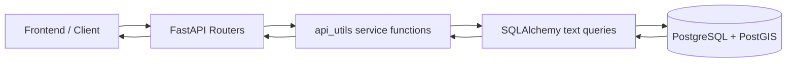

# Urban Risk API Service Architecture and Algorithms

Last updated: 2026-03-13

## 1. Purpose of This Document

This document is a technical handover for the current backend. It explains:

1. API service architecture and stack choices
2. Endpoint groups and responsibilities
3. Core algorithms (risk scoring, forecasting, hotspots, map clustering, tile safety scoring)
4. Persistence behavior for watchlist analytics runs
5. Validation, error handling, and performance choices

It is written to help engineers reason about behavior, not just call endpoints.

## 2. Stack and Why

### Application stack
- FastAPI for HTTP routing, request validation, OpenAPI docs
- SQLAlchemy Core (`text()` queries + bind params) for explicit SQL control
- PostgreSQL + PostGIS for spatial storage and geospatial SQL
- Psycopg driver under SQLAlchemy
- Uvicorn ASGI server

### Security/auth stack
- JWT bearer auth (`python-jose`)
- Password hashing with `bcrypt`
- Per-request user resolution from token (`/me`, protected endpoints)

### Why this stack
- Spatial analytics and map/tiles are SQL-heavy, so explicit SQL is clearer and easier to tune than ORM abstractions.
- PostGIS provides robust spatial primitives (`ST_MakeEnvelope`, `ST_Intersects`, `ST_AsMVT`, etc.).
- FastAPI gives strict request parsing + generated docs for frontend integration.

## 3. Runtime Architecture

### Code layout
- `backend/app/api/*`: endpoint routers
- `backend/app/api_utils/*`: query builders + algorithm logic
- `backend/app/schemas/*`: request/response contracts
- `backend/app/db.py`: engine, pool, timeouts
- `backend/app/bootstrap.py`: startup schema bootstrap + admin seed

## 4. Endpoint Service Overview (Grouped)

## 4.1 Auth and Profile
- `POST /auth/register`
- `POST /auth/login`
- `GET /me`
- `PATCH /me`

Purpose:
- account creation/login/profile updates
- JWT issuance and authenticated user context

## 4.2 Crime Services
- `GET /crimes/incidents`
- `GET /crimes/map`
- `GET /crimes/analytics/summary`
- `GET /crimes/analytics/timeseries`
- `GET /crimes/{crime_id}`

Purpose:
- tabular incident browsing
- map viewport rendering (points/clusters)
- summary cards and time series

## 4.3 Collision Services
- `GET /collisions/incidents`
- `GET /collisions/map`
- `GET /collisions/analytics/summary`
- `GET /collisions/analytics/timeseries`

Purpose:
- collision incident browsing, map rendering, and chart metrics

## 4.4 Roads Services
- `GET /roads/analytics/meta`
- `GET /roads/analytics/overview`
- `GET /roads/analytics/charts`
- `GET /roads/analytics/risk`

Purpose:
- road-level risk insight using crime-linked segment analytics

## 4.5 Tile Services
- `GET /tiles/roads/{z}/{x}/{y}.mvt`
- `GET /tiles/roads/{z}/{x}/{y}.pbf`

Purpose:
- vector tile generation for roads
- optional per-segment safety/risk attributes

## 4.6 Advanced Analytics Services
- `GET /analytics/meta`
- `POST /analytics/risk/score`
- `POST /analytics/risk/forecast`
- `GET /analytics/patterns/hotspot-stability`

Purpose:
- explainable, research-style risk metrics and trend analytics

## 4.7 LSOA Service
- `GET /lsoa/categories`

Purpose:
- filter catalog + bounding extents per LSOA label (derived from `crime_events`)

## 4.8 User-Reported Incidents
- `POST /reported-events`
- `GET /reported-events/mine`
- `GET /admin/reported-events`
- `PATCH /admin/reported-events/{report_id}/moderation`
- `GET /user-events`

Purpose:
- crowd-sourced signal capture and admin moderation
- approved reports are blended into analytics algorithms

## 4.9 Watchlist Services
- `GET /watchlists`
- `POST /watchlists`
- `PATCH /watchlists/{watchlist_id}`
- `DELETE /watchlists/{watchlist_id}`
- `POST /watchlists/{watchlist_id}/risk-score/run`
- `GET /watchlists/{watchlist_id}/risk-score/results`
- `POST /watchlists/{watchlist_id}/risk-forecast/run`
- `GET /watchlists/{watchlist_id}/risk-forecast/results`
- `POST /watchlists/{watchlist_id}/hotspot-stability/run`
- `GET /watchlists/{watchlist_id}/hotspot-stability/results`

Purpose:
- save query scopes/preferences and persist analytics outputs per watchlist

## 5. Shared Validation Rules and Error Semantics

Common behavior:
- `YYYY-MM` parsing for month inputs
- bbox validation (`min < max` on both axes)
- mode validation (`walk` vs `drive`)
- collision inclusion only supported in drive mode

Error semantics:
- 400 for validation/domain errors (`INVALID_MONTH_FORMAT`, `INVALID_DATE_RANGE`, etc.)
- 401 for auth failures
- 404 for not-found resources
- 503 when DB execution fails (wrapped from SQLAlchemy/driver exceptions)

## 6. Core Algorithms

## 6.1 Crime/Collision Map Mode Resolution (`/crimes/map`, `/collisions/map`)

Mode logic:
- explicit `mode=points` -> points
- explicit `mode=clusters` -> clusters
- `mode=auto`:
  - `zoom <= 11` -> clusters
  - `zoom >= 12` -> points

Point pagination:
- cursor-based ordering by `(month desc, id desc)` (or collision index)
- cursor format:
  - crimes: `YYYY-MM|id`
  - collisions: `YYYY-MM|collision_index`

Default limits:
- clusters: lower zoom gets fewer clusters, higher zoom gets more
- points: higher zoom gets higher default limits

## 6.2 Grid Clustering Algorithm (Crimes + Collisions)

Used in cluster mode for viewport endpoints.

Cell sizing (`crime_utils._cluster_grid_size`):
- zoom `<= 8`: divide bbox into 12x12
- zoom `<= 10`: divide bbox into 16x16
- zoom `>= 11`: divide bbox into 20x20
- minimum cell width/height clamp: `0.0001`

Cluster construction:
1. Filter events to bbox + month/range + optional categorical filters.
2. Compute grid cell:
   - `cell_x = floor((lon - min_lon) / cell_width)`
   - `cell_y = floor((lat - min_lat) / cell_height)`
3. Aggregate by cell:
   - crimes: point count + top 3 crime types
   - collisions: point count + total casualties + top severities
4. Cluster centroid = average lon/lat in the cell.
5. Return as GeoJSON features with stable `cluster_id = "{zoom}:{cell_x}:{cell_y}"`.

## 6.3 Roads Tile Safety/Risk Scoring (`/tiles/roads/...` with `includeRisk=true`)

This is the most map-oriented road risk algorithm in the app.

Constants (`tiles_utils.py`):
- `CRIME_WEIGHT = 0.55`
- `COLLISION_WEIGHT = 0.45`
- `RISK_LENGTH_FLOOR_M = 100.0`
- collision severity weights:
  - slight: `0.5`
  - serious: `2.0`
  - fatal: `5.0`

User-reported signal blend:
- same capped weighted signal model as analytics (section 6.6)

Per-segment metrics:
- `normalized_km = max(length_m, 100) / 1000`
- `crimes = official_crimes + user_reported_crime_signal`
- `crimes_per_km = crimes / normalized_km`
- `collision_points = collisions + 0.5*slight + 2.0*serious + 5.0*fatal`
- `collision_density = collision_points / normalized_km`

Ranking and normalization:
1. `crime_pct = percent_rank(crimes_per_km)` among active roads
2. `collision_pct = percent_rank(collision_density)` among active roads
3. `raw_safety_score = ((crime_pct*0.55)+(collision_pct*0.45))*100`
4. Re-normalize:
   - `pct = percent_rank(raw_safety_score)`
   - `safety_score = pct * 100`

Banding in tile response:
- `safety_score >= 50` -> `red`
- `safety_score >= 30` -> `orange`
- else `green`

Note:
- Road-only tile mode (`includeRisk=false`) does no scoring and returns geometry/properties only.
- `includeRisk=true` requires `month` or `startMonth/endMonth`.

## 6.4 Risk Score Algorithm (`POST /analytics/risk/score`)

Goal:
- produce an explainable area risk score for a bbox + date window

Step A: area-level aggregates
- total crimes in bbox/date window
- approved user reports and weighted user-report signal
- optional collision counts and collision severity points
- `area_km2` from bbox geometry

Step B: segment-level densities (for normalization)
- For each road segment:
  - `crime_density = (official + user_signal) / normalized_km`
  - `collision_density = weighted_collision_points / normalized_km`
  - `combined_density = w_crime*crime_density + w_collision_applied*collision_density`

Step C: percentile score
- Compute `avg_density` over in-scope segments
- Compute `avg_density_pct` = share of segments whose `combined_density <= avg_density`
- Final score:
  - `score = round(100 * avg_density_pct)`
  - `pct = round(avg_density_pct, 4)`

Bands:
- `pct >= 0.95` -> red
- `pct >= 0.80` -> amber
- else green

Collision inclusion guard:
- if `includeCollisions=false` or `mode != drive`, applied collision weight becomes `0.0`.

## 6.5 Forecast Algorithm (`POST /analytics/risk/forecast`)

Method implemented:
- `poisson_mean` (transparent baseline average model)

Inputs:
- target month `YYYY-MM`
- baselineMonths (3 to 24)
- bbox + optional crime type + optional collision mode

Coverage validation:
1. Build required baseline month set via `generate_series`.
2. Ensure each baseline month exists in `crime_events`.
3. If collisions included, ensure each baseline month exists in `collision_events`.
4. If not, return `BASELINE_HISTORY_INSUFFICIENT`.

History construction (monthly):
- official crime count + weighted user report signal
- optional collision count + collision points
- combined value:
  - `combined_value = w_crime*crime_count + w_collision*collision_points`

Forecast output:
- `baseline_mean = avg(crime_count history)`
- `expected_count = round(baseline_mean)`
- 95% CI (normal approximation around Poisson mean):
  - `low = floor(max(0, mean - 1.96*sqrt(mean)))`
  - `high = ceil(mean + 1.96*sqrt(mean))`

Risk projection band (`returnRiskProjection=true`):
- default green
- if projection ratio `>= 1.5`: red
- else if `>= 1.25`: amber

## 6.6 User-Reported Crime Signal Weighting (Used Across Analytics/Tiles)

Constants:
- base multiplier: `0.10`
- anonymous multiplier: `0.5`
- repeat authenticated multiplier: `0.25`
- signal cap: `3.0`

For a grouped context:
- `signal = 0.10 * min(3.0, distinct_authenticated_users + 0.5*anonymous_reports + 0.25*max(authenticated_reports - distinct_authenticated_users, 0))`

Design intent:
- include crowd signal as a low-weight supplement
- prevent spam/outlier dominance through cap
- preserve official data as primary driver

## 6.7 Hotspot Stability Algorithm (`GET /analytics/patterns/hotspot-stability`)

Goal:
- quantify whether top risky road segments persist month-to-month

Process:
1. For each month in `[from, to]`, compute segment `crimes_per_km`.
2. Rank segments descending and take top `k`.
3. Compute month-to-month Jaccard:
   - `jaccard = |A ∩ B| / |A ∪ B|`
4. Count each segment’s appearances across months.
5. `appearance_ratio = appearances / months_evaluated`.

Outputs:
- `stability_series` (month, jaccard_vs_prev, overlap_count)
- `persistent_hotspots` (segment_id, appearances, appearance_ratio)
- optional `topk_by_month` list

## 6.8 Roads Analytics Risk Algorithm (`/roads/analytics/overview|charts|risk`)

These endpoints compute a road incident score from crime-linked segment events.

Per segment:
- `incident_count = count(events)`
- `incidents_per_km = incident_count / max(length_m, 100m in km)`

Percentile features:
- `pct_count = percent_rank(incident_count)`
- `pct_density = percent_rank(incidents_per_km)`

Road risk score:
- `risk_score = ((pct_count * 0.65) + (pct_density * 0.35)) * 100`

Road band thresholds (`roads_utils._risk_band_expression`):
- `risk_score >= 90` -> red
- `risk_score >= 70` -> orange
- else green

This is separate from tile banding and analytics `/risk/score` banding; each serves a different product surface.

## 7. Watchlist Analytics Persistence Behavior

Generic analytics endpoints:
- `/analytics/risk/score`
- `/analytics/risk/forecast`
- `/analytics/patterns/hotspot-stability`

do **not** persist runs.

Watchlist run endpoints do persist:
- `/watchlists/{id}/risk-score/run`
- `/watchlists/{id}/risk-forecast/run`
- `/watchlists/{id}/hotspot-stability/run`

Storage table:
- `watchlist_analytics_runs`
  - `report_type`
  - `request_params_json`
  - `payload_json`

Current fixed watchlist run constants in code:
- `hotspot_k = 20`
- `include_forecast = true` (logic fixed-on)
- `include_hotspot_stability = true` (logic fixed-on)
- `w_crime = 1.0`
- `w_collision = 0.8`

## 8. Performance and Operational Decisions

DB engine settings (`db.py`):
- pool pre-ping enabled
- configurable pool size/overflow/timeouts
- statement timeout default `15000 ms`
- session-level parallel workers disabled for stability (`max_parallel_workers = 0`)

Caching:
- crime analytics snapshot in-memory TTL cache: `60s`
- vector tile HTTP cache-control: `public, max-age=60`

Why:
- reduce repeated heavy aggregation for active dashboard views
- keep data reasonably fresh while limiting DB pressure

## 9. Design Tradeoffs and Rationale

1. Percentile normalization vs raw counts:
- protects against road-length and scope-size bias
- easier to compare risk relative to peers

2. Multiple banding systems:
- tile bands are tuned for dense map visualization
- roads analytics bands are tuned for ranked road tables
- analytics risk score uses strict percentile cutoffs (`red >= 95th`)

3. JSON persistence for watchlist runs:
- flexible payload evolution
- easy write path
- tradeoff: weaker ad-hoc SQL querying on nested fields

4. User report blending as low-weight signal:
- improves recency and citizen input
- avoids letting unverified volume dominate official records

## 10. Quick Endpoint-to-Algorithm Map

1. Viewport map rendering:
- `/crimes/map`, `/collisions/map`
- algorithm: mode resolver + grid cluster or paginated points

2. Road visual safety overlay:
- `/tiles/roads/{z}/{x}/{y}.mvt|.pbf`
- algorithm: per-segment crime/collision density -> percentile -> band

3. Area risk cards:
- `/analytics/risk/score`
- algorithm: area aggregates + segment percentile normalization

4. Forecast chart + projection:
- `/analytics/risk/forecast`
- algorithm: baseline mean + coverage validation + CI

5. Pattern persistence:
- `/analytics/patterns/hotspot-stability`
- algorithm: top-k monthly overlap and Jaccard persistence

6. Road analytics pages:
- `/roads/analytics/*`
- algorithm: segment incident scoring with count+density blend

