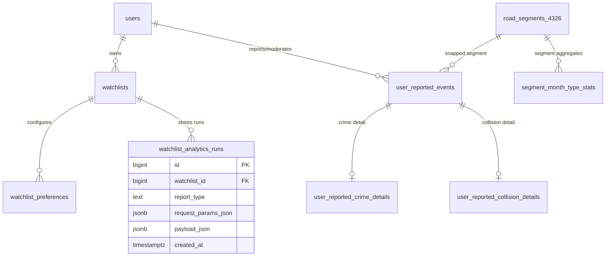
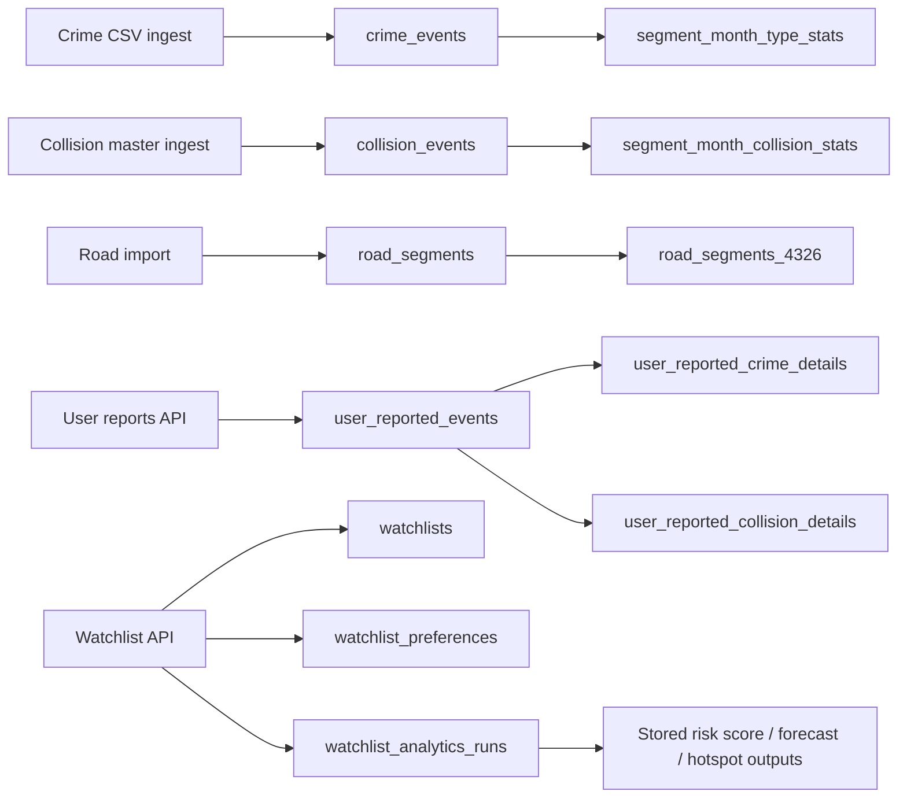

# Urban Risk Database Architecture

Last updated: 2026-03-13

## 1. Overview

The `urban_risk` PostgreSQL database (with PostGIS enabled) is organized into six domains:

1. Identity and access (`users`)
2. Watchlists and stored analytics runs (`watchlists`, `watchlist_preferences`, `watchlist_analytics_runs`)
3. Crime data (`crime_events`, `segment_month_type_stats`)
4. Collision data (`collision_events`, `segment_month_collision_stats`)
5. Roads and boundaries (`road_segments`, `road_segments_4326`, `lsoa_boundaries`)
6. User-reported incidents (`user_reported_events`, `user_reported_crime_details`, `user_reported_collision_details`)

The OSM import staging tables (`planet_osm_*`, `osm2pgsql_properties`) were removed and are no longer part of the active architecture.

## 2. Core ER Diagram

## 3. Data Flow Diagram

## 4. Foreign Keys (live schema)

1. `watchlists.user_id -> users.id`
2. `watchlist_preferences.watchlist_id -> watchlists.id`
3. `watchlist_analytics_runs.watchlist_id -> watchlists.id`
4. `user_reported_events.user_id -> users.id`
5. `user_reported_events.moderated_by -> users.id`
6. `user_reported_crime_details.event_id -> user_reported_events.id`
7. `user_reported_collision_details.event_id -> user_reported_events.id`
8. `segment_month_type_stats.segment_id -> road_segments_4326.id`

## 5. Table Dictionary

### 5.1 Identity

#### `users`
Purpose: authentication and authorization.

Columns:
- `id` bigint PK
- `email` text unique, not null
- `password_hash` text, not null
- `is_admin` boolean, not null, default `false`
- `created_at` timestamptz, not null, default `now()`

### 5.2 Watchlists and Saved Analytics

#### `watchlists`
Purpose: user-defined monitoring bounding boxes.

Columns:
- `id` bigint PK
- `user_id` bigint FK -> `users.id`
- `name` text
- `min_lon`, `min_lat`, `max_lon`, `max_lat` double precision
- `created_at` timestamptz default `now()`

#### `watchlist_preferences`
Purpose: per-watchlist analytics configuration.

Columns:
- `id` bigint PK
- `watchlist_id` bigint FK -> `watchlists.id`
- `window_months` integer
- `travel_mode` text
- `crime_types` text[] default empty array
- `include_collisions` boolean default `false`
- `baseline_months` integer default `6`
- `created_at` timestamptz default `now()`

#### `watchlist_analytics_runs`
Purpose: persisted results for watchlist-triggered analytics endpoints.

Columns:
- `id` bigint PK
- `watchlist_id` bigint FK -> `watchlists.id`
- `report_type` text (`risk_score`, `risk_forecast`, `hotspot_stability`)
- `request_params_json` jsonb
- `payload_json` jsonb
- `created_at` timestamptz default `now()`

### 5.3 Crime Domain

#### `crime_events`
Purpose: raw and enriched police crime events.

Columns:
- `id` bigint PK
- `crime_id` text
- `month` date
- `reported_by` text
- `falls_within` text
- `lon`, `lat` double precision
- `geom` geometry(Point,4326)
- `location_text` text
- `lsoa_code`, `lsoa_name` text
- `crime_type` text
- `last_outcome_category` text
- `context` text
- `segment_id` bigint (snapped road segment id)
- `created_at` timestamptz default `now()`

#### `segment_month_type_stats`
Purpose: precomputed crime counts by `segment_id + month + crime_type`.

Columns:
- `segment_id` bigint FK -> `road_segments_4326.id`
- `month` date
- `crime_type` text
- `crime_count` integer

Primary key:
- `(segment_id, month, crime_type)`

### 5.4 Collision Domain

#### `collision_events`
Purpose: master collision events (decoded + aggregated attributes).

Columns:
- Core identity/time: `collision_index`, `collision_year`, `collision_date`, `collision_time`, `month`
- Location: `latitude`, `longitude`, `geom`
- Geography: `local_authority_ons_district`, `lsoa_of_accident_location`
- Decoded code-pairs:
  - `collision_severity_code`, `collision_severity_label`
  - `speed_limit_code`, `speed_limit_label`
  - `road_type_code`, `road_type_label`
  - `light_conditions_code`, `light_conditions_label`
  - `weather_conditions_code`, `weather_conditions_label`
  - `road_surface_conditions_code`, `road_surface_conditions_label`
- Counts and aggregates:
  - `number_of_vehicles`, `number_of_casualties`
  - `vehicle_count`, `vehicle_type_counts`, `avg_driver_age`, `driver_sex_counts`
  - `casualty_count`, `casualty_severity_counts`, `casualty_type_counts`
  - `fatal_casualty_count`, `serious_casualty_count`, `slight_casualty_count`
- Road snap fields: `segment_id`, `snap_distance_m`
- `created_at`

#### `segment_month_collision_stats`
Purpose: precomputed collision/casualty counts by `segment_id + month`.

Columns:
- `segment_id` bigint
- `month` date
- `collision_count` integer
- `casualty_count` integer
- `fatal_casualty_count` integer
- `serious_casualty_count` integer
- `slight_casualty_count` integer

Primary key:
- `(segment_id, month)`

### 5.5 Roads and Boundary Domain

#### `road_segments`
Purpose: primary road geometry for analytics and tile generation (Web Mercator).

Columns:
- `id` bigint PK
- `osm_id` bigint
- `name` text
- `highway` text
- `geom` geometry(LineString,3857)
- `length_m` double precision

#### `road_segments_4326`
Purpose: 4326 variant used for snapping and selected joins.

Columns:
- `id` bigint PK
- `osm_id` bigint
- `name` text
- `highway` text
- `geom` geometry
- `length_m` double precision

#### `lsoa_boundaries`
Purpose: lookup/filter geometry dataset for LSOA areas.

Columns:
- `fid` integer
- `lsoa21cd`, `lsoa21nm`, `lsoa21nmw` text
- `bng_e`, `bng_n` integer
- `lat`, `long` double precision
- `shape_area`, `shape_length` double precision
- `global_id` uuid
- `geom` geometry

### 5.6 User-Reported Incidents

#### `user_reported_events`
Purpose: moderation-managed crowd reports for crime/collision signals.

Columns:
- `id` bigint PK
- `event_kind` text (`crime` or `collision`)
- `reporter_type` text (`anonymous` or `authenticated`)
- `user_id` bigint FK -> `users.id` (nullable for anonymous)
- `event_date`, `event_time`, `month`
- `longitude`, `latitude`, `geom`
- `segment_id`, `snap_distance_m`
- `description`
- Moderation: `admin_approved`, `moderation_status`, `moderation_notes`, `moderated_by`, `moderated_at`
- `created_at`, `updated_at`

#### `user_reported_crime_details`
Purpose: one-to-one extension for crime report payload.

Columns:
- `event_id` bigint PK/FK -> `user_reported_events.id`
- `crime_type` text

#### `user_reported_collision_details`
Purpose: one-to-one extension for collision report payload.

Columns:
- `event_id` bigint PK/FK -> `user_reported_events.id`
- `weather_condition` text
- `light_condition` text
- `number_of_vehicles` integer

## 6. System / PostGIS Metadata Tables

These are managed by PostGIS and should not be manually removed:
- `geometry_columns`
- `geography_columns`
- `spatial_ref_sys`

## 7. Current Architectural Notes

1. Watchlist run results are still persisted in JSON (`request_params_json`, `payload_json`) in `watchlist_analytics_runs`.
2. Analytics runtime mostly reads from:
- `crime_events`
- `collision_events`
- `segment_month_type_stats`
- `segment_month_collision_stats`
- `road_segments`
- `user_reported_events` (+ detail tables)
3. `segment_month_type_stats` currently references `road_segments_4326` by FK; analytics also uses `road_segments` in several queries.

