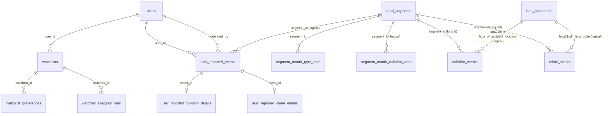

# Public Schema Data Description

## Scope

This document describes the `public` schema tables in the `urban_risk` PostgreSQL database (from the running Docker DB container).

Included: `public` base tables only.  
Excluded: `tiger`, `topology`, and system schemas/views.

## Public Tables Overview

| Table | Primary Key | Purpose | Key Links |
|---|---|---|---|
| `collision_events` | `collision_index` | Collision event facts with location, severity, casualties, and derived aggregates. | Logical link: `segment_id` -> `road_segments.id`; logical link to `lsoa_boundaries` via LSOA code. |
| `crime_events` | `id` | Crime events with location, type, and context. | Logical link: `segment_id` -> `road_segments.id`; logical link to `lsoa_boundaries` via LSOA code. |
| `lsoa_boundaries` | `fid` | LSOA boundary polygons and identifiers. | Referenced logically by event LSOA code fields. |
| `road_segments` | `id` | Road network segments with both projected and geographic geometry (`geom`, `geom_4326`). | FK target for `segment_month_type_stats.segment_id`; logical target for event/stat `segment_id` columns. |
| `segment_month_collision_stats` | (`segment_id`, `month`) | Monthly collision aggregates by road segment. | Logical link to `road_segments.id`; derived from `collision_events`. |
| `segment_month_type_stats` | (`segment_id`, `month`, `crime_type`) | Monthly crime-type aggregates by road segment. | FK: `segment_id` -> `road_segments.id`; derived from `crime_events`. |
| `spatial_ref_sys` | `srid` | Spatial reference definitions (PostGIS). | Spatial metadata support table. |
| `user_reported_collision_details` | `event_id` | Collision-specific detail row for user-reported events. | FK: `event_id` -> `user_reported_events.id`. |
| `user_reported_crime_details` | `event_id` | Crime-specific detail row for user-reported events. | FK: `event_id` -> `user_reported_events.id`. |
| `user_reported_events` | `id` | User-submitted events with moderation and snapped location fields. | FK: `user_id` -> `users.id`; FK: `moderated_by` -> `users.id`; parent of detail tables. |
| `users` | `id` | Application users and auth/admin fields. | Parent of `watchlists` and `user_reported_events`. |
| `watchlist_analytics_runs` | `id` | Stored analytics runs/results for watchlists. | FK: `watchlist_id` -> `watchlists.id`. |
| `watchlist_preferences` | `id` | User watchlist configuration (windows, filters, modes). | FK: `watchlist_id` -> `watchlists.id`. |
| `watchlists` | `id` | User-defined geographic watchlist areas. | FK: `user_id` -> `users.id`; parent of preferences and analytics runs. |

## ER Diagram (Public Tables Only)

## Enforced Foreign Keys (Public Schema)

| Child Table | Child Column | Parent Table | Parent Column | On Delete |
|---|---|---|---|---|
| `segment_month_type_stats` | `segment_id` | `road_segments` | `id` | `NO ACTION` |
| `user_reported_collision_details` | `event_id` | `user_reported_events` | `id` | `CASCADE` |
| `user_reported_crime_details` | `event_id` | `user_reported_events` | `id` | `CASCADE` |
| `user_reported_events` | `moderated_by` | `users` | `id` | `SET NULL` |
| `user_reported_events` | `user_id` | `users` | `id` | `SET NULL` |
| `watchlist_analytics_runs` | `watchlist_id` | `watchlists` | `id` | `CASCADE` |
| `watchlist_preferences` | `watchlist_id` | `watchlists` | `id` | `CASCADE` |
| `watchlists` | `user_id` | `users` | `id` | `CASCADE` |

## Notes

- `collision_events`, `crime_events`, `user_reported_events`, and `segment_month_collision_stats` contain `segment_id` but not all of these links are enforced as DB foreign keys.
- `segment_month_collision_stats` and `segment_month_type_stats` are aggregate/stat tables keyed by segment and month.
- `user_reported_collision_details` and `user_reported_crime_details` act as subtype detail tables for `user_reported_events` by shared `event_id`.
