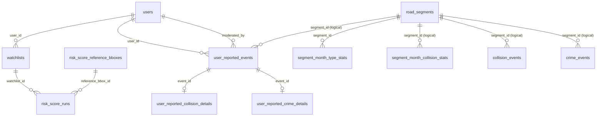

# Public Schema Data Description

## Scope

This document describes the application-facing `public` schema model used by the `urban_risk` API.

Included: `public` base tables only.  
Excluded: `tiger`, `topology`, and system schemas/views.

## Public Tables Overview

| Table | Primary Key | Purpose | Key Links |
|---|---|---|---|
| `collision_events` | `collision_index` | Collision event facts with location, severity, casualties, and derived aggregates. | Logical link: `segment_id` -> `road_segments.id`. |
| `crime_events` | `id` | Crime events with location, type, and context. | Logical link: `segment_id` -> `road_segments.id`. |
| `risk_score_reference_bboxes` | `id` | Configured reference areas used for cohort/comparison context in risk scoring. | Parent of `risk_score_runs.reference_bbox_id`. |
| `risk_score_runs` | `id` | Persisted risk score computation outputs, run parameters, components, and comparison metrics. | FK: `watchlist_id` -> `watchlists.id`; FK: `reference_bbox_id` -> `risk_score_reference_bboxes.id`. |
| `road_segments` | `id` | Road network segments with both projected and geographic geometry (`geom`, `geom_4326`). | FK target for `segment_month_type_stats.segment_id`; logical target for event/stat `segment_id` columns. |
| `segment_month_collision_stats` | (`segment_id`, `month`) | Monthly collision aggregates by road segment. | Logical link to `road_segments.id`; derived from `collision_events`. |
| `segment_month_type_stats` | (`segment_id`, `month`, `crime_type`) | Monthly crime-type aggregates by road segment. | FK: `segment_id` -> `road_segments.id`; derived from `crime_events`. |
| `spatial_ref_sys` | `srid` | Spatial reference definitions (PostGIS). | Spatial metadata support table. |
| `user_reported_collision_details` | `event_id` | Collision-specific detail row for user-reported events. | FK: `event_id` -> `user_reported_events.id`. |
| `user_reported_crime_details` | `event_id` | Crime-specific detail row for user-reported events. | FK: `event_id` -> `user_reported_events.id`. |
| `user_reported_events` | `id` | User-submitted events with moderation and snapped location fields. | FK: `user_id` -> `users.id`; FK: `moderated_by` -> `users.id`; parent of detail tables. |
| `users` | `id` | Application users and auth/admin fields. | Parent of `watchlists` and `user_reported_events`. |
| `watchlists` | `id` | User-defined watchlist areas with bbox columns (`min_lon`, `min_lat`, `max_lon`, `max_lat`) and preference fields (`start_month`, `end_month`, `crime_types`, `travel_mode`, `baseline_months`). | FK: `user_id` -> `users.id`. |

## ER Diagram (Public Tables Only)

## Enforced Foreign Keys (Public Schema)

| Child Table | Child Column | Parent Table | Parent Column | On Delete |
|---|---|---|---|---|
| `risk_score_runs` | `reference_bbox_id` | `risk_score_reference_bboxes` | `id` | `SET NULL` |
| `risk_score_runs` | `watchlist_id` | `watchlists` | `id` | `CASCADE` |
| `segment_month_type_stats` | `segment_id` | `road_segments` | `id` | `NO ACTION` |
| `user_reported_collision_details` | `event_id` | `user_reported_events` | `id` | `CASCADE` |
| `user_reported_crime_details` | `event_id` | `user_reported_events` | `id` | `CASCADE` |
| `user_reported_events` | `moderated_by` | `users` | `id` | `SET NULL` |
| `user_reported_events` | `user_id` | `users` | `id` | `SET NULL` |
| `watchlists` | `user_id` | `users` | `id` | `CASCADE` |

## Notes

- `collision_events`, `crime_events`, `user_reported_events`, and `segment_month_collision_stats` contain `segment_id` but not all of these links are enforced as DB foreign keys.
- `risk_score_runs` links persisted score outputs back to both `watchlists` and optional `risk_score_reference_bboxes`.
- `segment_month_collision_stats` and `segment_month_type_stats` are aggregate/stat tables keyed by segment and month.
- `user_reported_collision_details` and `user_reported_crime_details` act as subtype detail tables for `user_reported_events` by shared `event_id`.
- Watchlist preference values are stored directly on `watchlists`; there is no separate `watchlist_preferences` table.
- `bbox_coords` is derived from stored watchlist columns (`min_lon`, `min_lat`, `max_lon`, `max_lat`).
- Canonical analytics hashes/signatures do not include `include_collisions`.
- Cohort-based comparison outputs only apply when cohort size is at least `2`.
