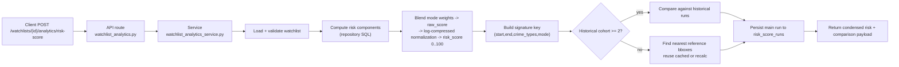

# Watchlist Analytics Risk Score

This document explains the new watchlist-based analytics risk score flow implemented in:
- `POST /watchlists/{watchlist_id}/analytics/risk-score`
- `GET /watchlists/{watchlist_id}/analytics/risk-score/runs`

## 1) Endpoints

### Compute and persist one run
- **Route:** `POST /watchlists/{watchlist_id}/analytics/risk-score`
- **Auth:** required
- **Input:** `watchlist_id` path param only
- **Source of algorithm inputs:** watchlist row values:
  - bbox: `min_lon`, `min_lat`, `max_lon`, `max_lat`
  - window: `start_month`, `end_month`
  - filters: `crime_types`
  - mode: `travel_mode` (`walk` or `drive`)

### Fetch previous runs
- **Route:** `GET /watchlists/{watchlist_id}/analytics/risk-score/runs?limit=50`
- **Auth:** required
- **Output:** persisted risk runs for that watchlist, newest first

---

## 2) High-level Flow



---

## 3) Algorithm Details

The computation uses three signals inside the watchlist bbox and month window:

1. **Crime component**
- Applies harm weights by crime type.
- Applies monthly recency decay.
- Computes area-normalized crime density.
- Blends density with persistence (`active_months / window_months`).

2. **Collision component**
- Uses severity-weighted collision points:
  - `collisions + 0.5*slight + 2.0*serious + 5.0*fatal`
- Applies collision recency decay.
- Normalizes by effective road exposure (`max(road_km, floor)`).

3. **User-report support**
- Lightweight clustered signal (no heavy geo clustering).
- Applies caps and down-weighted anonymous/repeat contributions.
- Applies faster decay than official signals.
- Produces crime-like and collision-like user support densities.

Then mode-specific blending is applied:
- `walk`: stronger crime weighting
- `drive`: stronger collision weighting

Raw score is converted into final `risk_score` in `[0,100]` using **log-compressed saturation scaling**:

```text
raw_non_negative = max(raw_score, 0)
compressed = log1p(min(raw_non_negative, 5000))
risk_score = round(100 * (1 - exp(-compressed / 2.5)))
```

This reduces top-end score collapse (many areas all returning `100`) and preserves more separation between high-risk areas.

---

## 4) Comparison Strategy (Proof That We Compare)

The service always builds a canonical **signature key** from:
- scoring version marker (`v2_log_norm`)
- `start_month`
- `end_month`
- sorted `crime_types`
- `travel_mode`

Including the scoring version marker ensures comparisons do not mix runs produced by older normalization logic with current runs.

Then:
- if same-signature historical runs count is `>= 2`:
  - compare against historical cohort
- else:
  - fallback to nearest active rows in `risk_score_reference_bboxes`
  - use cached reference runs if present
  - otherwise recalculate and persist reference runs

Returned comparison fields include:
- `cohort_type`
- `cohort_size`
- `subject_score`
- `rank`, `rank_out_of`
- `percentile`
- `distribution` (`min`, `median`, `max`)
- `historical_count`, `threshold`
- `reference_ids` (if reference fallback used)

---

## 5) Persistence Model

### Main run storage
- Table: `risk_score_runs`
- Stores:
  - watchlist linkage
  - bbox used
  - month window
  - filters + mode
  - signature key
  - risk output and components
  - comparison metadata
  - execution time

### Reference bbox storage
- Table: `risk_score_reference_bboxes`
- Stores static comparison areas (e.g., Leeds reference boxes)

---

## 6) Response Shape (Compute Endpoint)

```json
{
  "watchlist_id": 42,
  "risk_result": {
    "risk_score": 87,
    "raw_score": 172.6377059356513,
    "components": {
      "crime_component": 265.51043983457663,
      "collision_density": 0.20634807670352054,
      "user_support": 0.043330240006142516
    }
  },
  "comparison": {
    "cohort_type": "reference_bboxes",
    "cohort_size": 2,
    "subject_score": 87,
    "rank": 2,
    "rank_out_of": 2,
    "percentile": 50.0,
    "distribution": {
      "min": 84.0,
      "median": 86.0,
      "max": 88.0
    },
    "sample_size": 2,
    "historical_count": 0,
    "threshold": 2,
    "reference_ids": [22, 23]
  }
}
```

---

## 7) Implementation Map

- API: `backend/app/api/watchlist_analytics.py`
- Service: `backend/app/services/watchlist_analytics_service.py`
- Repository: `backend/app/api_utils/watchlist_analytics_repository.py`
- Response schemas: `backend/app/schemas/watchlist_analytics_schemas.py`
